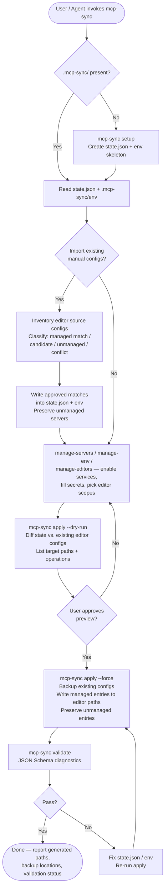

# mcp-sync
A reusable, project-agnostic toolkit for managing MCP (Model Context Protocol) server configuration across editors and projects — packaged as a Claude Agent Skill. It picks the MCP services a project should run, collects the environment variables they need, and writes editor-specific MCP config files (Claude Code, Cursor, Windsurf, etc.) deterministically from a single source of truth under `.mcp-sync/` in the target project.

The skill ships as a real Node package with a `bin: mcp-sync` entry, an interactive setup CLI (Ink and OpenTUI surfaces included), and an agent-operated workflow for AI coding agents that need to inspect, preview, and apply MCP config without asking the user to open a terminal.

## Install

The fastest cross-agent install path is the `skills` CLI:

```bash
npx skills add gg-skills/mcp-sync
```

Drop this skill into a workspace as a Git submodule for pinned versions, or as a plain clone for latest `main`:

```bash
# Project-local, version-pinned:
git submodule add git@github.com:gg-skills/mcp-sync.git .claude/skills/mcp-sync

# OR project-local, latest main:
mkdir -p .claude/skills
git -C .claude/skills clone git@github.com:gg-skills/mcp-sync.git

# OR user-level, available in every project on this machine:
mkdir -p ~/.claude/skills
git -C ~/.claude/skills clone git@github.com:gg-skills/mcp-sync.git
```

Restart your agent or reload skills after installation. See the parent [`skills` catalog repo](https://github.com/gg-skills/skills) for the full catalog.

## When to use

- Installing or running MCP Sync in a project for the first time.
- Managing `.mcp-sync/` runtime state, MCP service preferences, or editor MCP config writes.
- Importing existing manually maintained MCP editor configs into deterministic `.mcp-sync/` state without losing private/local servers.
- Adding generic MCP server templates or new editor adapters to the toolkit itself.
- Debugging the `mcp-sync setup`, `mcp-sync apply`, `mcp-sync validate`, Ink, or OpenTUI flows.

Skip it when the task is about a single project's private MCP server or secret policy that doesn't belong in a generic registry, when a host repository wants its `package.json` to reference this skill directly (it shouldn't — the host stays unaware), or when the user only needs editor-specific manual MCP setup outside this toolkit.

## How it operates

### Inputs

**`MCP_SYNC_PROJECT_ROOT` environment variable** — overrides the target project root when running package-local npm scripts from the skill checkout rather than from inside the target project. Example: `MCP_SYNC_PROJECT_ROOT=/absolute/path/to/project npm run mcp:apply`. Without it, scripts resolve the project root from the current working directory.

**Source MCP server configs** (read-only at discovery time):
- `.mcp-sync/state.json` — runtime state: which server IDs are enabled, transport preferences per service, editor scopes, and sync metadata.
- `.mcp-sync/env` — secret dotenv values for enabled servers (never printed; reported as `set` / `empty` / `missing`).
- Existing project-scoped editor configs (e.g. `.cursor/mcp.json`, `.claude/mcp.json`) read during import/diff to preserve unmanaged servers.
- Global editor configs (e.g. `~/.cursor/mcp.json`) — only read after explicit user approval.
- Bundled generic server registry inside `scripts/servers/` and `scripts/services/`.

### Outputs

**Synced editor config files** written by `mcp-sync apply` (or `apply --force`):

| Editor | Project-scope path | Global-scope path |
|--------|-------------------|-------------------|
| Claude Code | `.claude/mcp.json` | `~/.claude/mcp.json` |
| Cursor | `.cursor/mcp.json` | `~/.cursor/mcp.json` |
| Windsurf | `.windsurf/mcp.json` | `~/.windsurf/mcp.json` |
| Windsurf Next | `.windsurf-next/mcp.json` | `~/.windsurf-next/mcp.json` |
| VS Code | `.vscode/mcp.json` | varies by OS |
| Zed | `.zed/settings.json` (mcpServers key) | `~/.config/zed/settings.json` |
| JetBrains | `.idea/mcp.json` | varies by OS |
| Kiro | `.kiro/mcp.json` | — |
| Warp | — | `~/.warp/mcp.json` |
| *(+ 20 more adapters)* | | |

**Backup files** — created automatically before any existing config is overwritten. Project-scope backups land in `.mcp-sync/backups/`. Global-scope backups are placed beside the original file as `.bak-<timestamp>` files.

**`mcp-sync validate`** — writes no files but exits non-zero and prints schema diagnostics when generated configs fail JSON Schema validation.

### External commands

The `mcp-sync` binary is the single entry point (`scripts/mcp-sync.ts`). It dispatches to one of these subcommands via `npx tsx`:

| Subcommand | Script | What it does |
|------------|--------|-------------|
| `setup` | `setup.ts` | Initializes `.mcp-sync/` directory, creates `state.json` skeleton, prompts for interactive surface choice |
| `manage-env` | `manage-env.ts` | Collects required env vars for enabled servers; writes/updates `.mcp-sync/env` |
| `manage-servers` | `manage-servers.ts` | Toggles generic services and transport preferences (`stdio-only`, `http-only`, `prefer-stdio`, `prefer-http`, `disabled`); updates `state.json` |
| `manage-editors` | `manage-editors.ts` | Picks which editors and scopes (project / global / instructions-only) to target; updates `state.json` |
| `apply` | `apply-config.ts` | Reads `state.json` + `.mcp-sync/env`, diffs against existing editor configs, backs up, then writes. Flags: `--dry-run` (preview, no writes), `--force` (skip prompt) |
| `backup` | `backup-configs.ts` | Snapshots selected editor config files without applying changes |
| `validate` | `validate-configs.ts` | Runs JSON Schema diagnostics on all generated editor configs |
| `ink` | `ui/cli-ink/index.mts` | Opens the React-Ink interactive shell (requires Bun + real TTY) |
| `opentui` | `ui/cli-opentui/main.tsx` | Opens the OpenTUI interactive shell (requires Bun + real TTY) |
| `interactive` | `ui/cli-interactive/main.ts` | Opens the `@inquirer/prompts` fallback console (tsx, works without Bun) |

npm scripts mirror every subcommand for use from the skill checkout:

```bash
npm run mcp:setup
npm run mcp:manage-servers
npm run mcp:manage-env
npm run mcp:manage-editors
npm run mcp:apply -- --dry-run
npm run mcp:apply -- --force
npm run mcp:backup
npm run mcp:validate
npm run mcp:cli:ink
npm run mcp:cli:opentui
npm run mcp:cli:interactive
```

### Side effects

- **Writes to target editor config locations.** `apply --force` creates or updates JSON/JSONC/TOML files at the paths configured in `state.json` for each enabled editor scope. Managed server entries are written deterministically; existing unmanaged entries (private/local servers) are merged and preserved.
- **Creates `.mcp-sync/` state** when `setup` runs: `state.json`, `env`, `env.example`, `instructions/`, `backups/`.
- **Backup on every apply.** Before overwriting any existing editor config, `apply` snapshots the original into `.mcp-sync/backups/` (project scope) or alongside the file as `.bak-<timestamp>` (global scope).
- **No host-repo side effects.** The skill does not modify the target project's `package.json`, `.gitignore`, or any file outside `.mcp-sync/` and the elected editor config paths.

### Mode toggles

- `apply --dry-run` — preview only; lists target paths and operations with no disk writes.
- `apply --force` — skips the interactive confirmation prompt; safe to call from non-TTY agent environments.
- `ink` / `opentui` — require a real TTY; exit immediately in non-interactive shells. Use `interactive` (tsx) or the agent-operated flow instead.
- Agent-operated mode — skip all interactive subcommands; edit `.mcp-sync/state.json` and `.mcp-sync/env` directly with file tools, then run `apply --dry-run` → approve → `apply --force` → `validate`.

## Operational flow



## Layout

```
.
├── SKILL.md                ← entry point, with YAML frontmatter
├── package.json            ← Node project manifest (bin: mcp-sync, mcp:* scripts)
├── tsconfig.json           ← TypeScript config for the CLI + controllers
├── jest.config.ts          ← skill-local Jest config
├── package-lock.json       ← pinned dependency tree
├── agents/                 ← generated agent metadata for IDE surfaces
├── assets/                 ← skill icons
├── references/             ← reference docs the skill loads on demand
│   ├── quick-reference.md
│   ├── storage.md
│   ├── agent-operated-workflow.md
│   └── import-existing-configs.md
└── scripts/                ← the actual toolkit
    ├── mcp-sync.ts                ← CLI entry point (the `bin` target)
    ├── setup.ts                   ← initialize .mcp-sync/ storage
    ├── manage-servers.ts          ← enable / disable services
    ├── manage-env.ts              ← collect required secrets
    ├── manage-editors.ts          ← pick project/global editor scopes
    ├── apply-config.ts            ← write editor configs (supports --dry-run / --force)
    ├── validate-configs.ts        ← schema diagnostics
    ├── backup-configs.ts          ← snapshot existing editor configs
    └── ui/
        ├── cli-ink/               ← React-Ink interactive surface
        ├── cli-opentui/           ← OpenTUI interactive surface
        └── cli-interactive/       ← @inquirer/prompts fallback
```

`package.json`, `tsconfig.json`, and `jest.config.ts` sit at the skill root on purpose — this is an installable Node tool with its own `bin`, not just guidance.

## Quick start

The skill exposes a `mcp-sync` command via its `bin` entry. Install it locally in a target project, link it, or invoke it through `npx`/`npm exec`.

Interactive flow from the target project root:

```bash
# Initialize .mcp-sync/ storage and pick an interactive surface.
mcp-sync setup

# Enable / disable generic services, transports, server IDs.
mcp-sync manage-servers

# Fill required secrets into .mcp-sync/env.
mcp-sync manage-env

# Pick editor scopes (project / global / instructions-only).
mcp-sync manage-editors

# Preview, then write editor configs.
mcp-sync apply --dry-run
mcp-sync apply --force

# Schema diagnostics.
mcp-sync validate
```

Running the CLI from the **skill checkout** against an external project — useful when the skill isn't installed in the target — uses `MCP_SYNC_PROJECT_ROOT` to redirect cwd-derived paths:

```bash
MCP_SYNC_PROJECT_ROOT=/absolute/path/to/project npm run mcp:setup
MCP_SYNC_PROJECT_ROOT=/absolute/path/to/project npm run mcp:manage-servers
MCP_SYNC_PROJECT_ROOT=/absolute/path/to/project npm run mcp:manage-env
MCP_SYNC_PROJECT_ROOT=/absolute/path/to/project npm run mcp:manage-editors
MCP_SYNC_PROJECT_ROOT=/absolute/path/to/project npm run mcp:apply -- --dry-run
MCP_SYNC_PROJECT_ROOT=/absolute/path/to/project npm run mcp:apply -- --force
MCP_SYNC_PROJECT_ROOT=/absolute/path/to/project npm run mcp:validate
```

Pick a UI surface explicitly when developing or debugging the interactive layer:

```bash
npm run mcp:cli:ink           # React-Ink surface (requires bun)
npm run mcp:cli:opentui       # OpenTUI surface (requires bun)
npm run mcp:cli:interactive   # @inquirer/prompts fallback (tsx)
```

Test the skill itself:

```bash
npm test
npm run test:watch
```

## Resources

- [`SKILL.md`](./SKILL.md) — full operating guidance, default-invocation behavior, report template, troubleshooting matrix.
- [`references/quick-reference.md`](./references/quick-reference.md) — concise command guide.
- [`references/storage.md`](./references/storage.md) — `.mcp-sync/` runtime storage details and ignore policy.
- [`references/agent-operated-workflow.md`](./references/agent-operated-workflow.md) — no-manual-terminal workflow for AI agents (inspect → report → offer options → preview → apply → close out).
- [`references/import-existing-configs.md`](./references/import-existing-configs.md) — migration workflow for importing existing MCP editor configs into deterministic runtime state.
- [`scripts/mcp-sync.ts`](./scripts/mcp-sync.ts) — CLI entry point that backs the `mcp-sync` bin.
- [`agents/openai.yaml`](./agents/openai.yaml) — generated agent metadata for IDE surfaces.

## Caveats

- **`.mcp-sync/` is target-project state, not skill state.** Runtime files (`env`, `state.json`, `instructions/`, `backups/`) live under the target project. Make sure the target project ignores `.mcp-sync/` before first use — the toolkit deliberately does not rely on the host's ignore rules.
- **Secrets never leave the target.** Reports and dry-runs should show `set` / `empty` / `missing` for env keys, never the values themselves.
- **Host repos stay unaware of this skill.** Do not wire host `package.json` scripts to `skills/mcp-sync`. Run it as a local/private tool (via `bin`, `npx`, or `MCP_SYNC_PROJECT_ROOT`).
- **`npm --prefix` does not preserve cwd.** When running package-local scripts from outside the target project, set `MCP_SYNC_PROJECT_ROOT=/absolute/project` explicitly.
- **Global writes need extra approval.** Backups happen automatically, but global editor config writes are higher-blast-radius than project writes — preview with `apply --dry-run` first.
- **The bundled registry is generic on purpose.** Project-specific server IDs, env var names, or task systems belong in a fork or a local extension, not in this repo.
- **Imports are not blind copies.** When migrating from existing manual configs, classify discovered servers (managed exact match / managed candidate / unmanaged private / conflict) before writing imported state — see `references/import-existing-configs.md`.
- **Ink and OpenTUI need a real TTY.** They will exit immediately in non-interactive environments. The `cli-interactive` (`@inquirer/prompts`) surface is the fallback for those cases.
